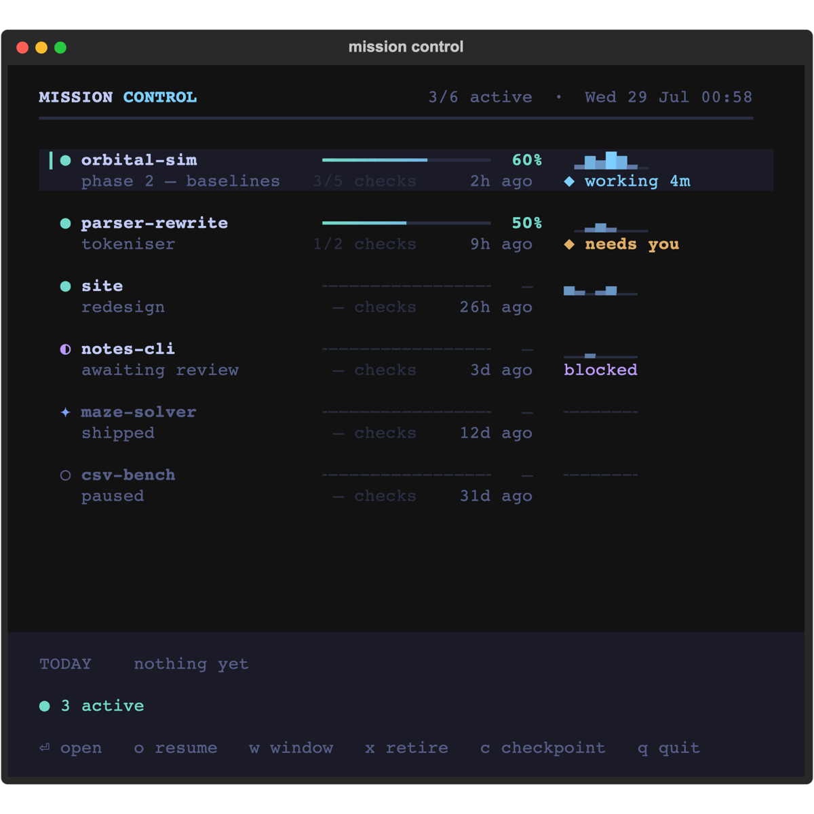

# mission control

A Textual TUI for people running Claude Code across a lot of projects.

It does three things: **repairs Claude sessions that lost their project**, shows
**progress you can't fake**, and **launches work into the tmux pane next door**.

<p align="center">
  
</p>

---

## The problem it was built for

Claude Code stores each session in a directory named after the **absolute path
you launched from**, with `/` encoded as `-`:

```
~/.claude/projects/-Users-you-projects-blog/<session-uuid>.jsonl
```

Nothing records that mapping anywhere else. So the moment you move or rename a
project directory, the link silently breaks — `claude --resume` in the new
location shows nothing, and the history is still on disk but unreachable. There
is no built-in command to repair it.

Reorganising a projects folder once orphaned **seven** of mine at a stroke, and I
didn't notice for weeks. `mc doctor` finds them, `mc fix` relinks them, and
`mc mv` moves projects without breaking them in the first place.

Everything is a **dry run unless you pass `--go`**, archives to
`~/.claude/archive/` before touching anything, and verifies transcript line
counts afterwards. Nothing is ever deleted.

---

## Install

```sh
uv tool install git+https://github.com/StanKarz/mission-control
mc init          # writes a starter config
mc doctor        # lists every directory on your machine with Claude sessions
```

Add the ones you care about to the config, then run `mc`.

Requires Python 3.12+. tmux is optional — only the launcher needs it.

---

## What it does

### Repairs orphaned sessions

```sh
mc doctor                    # classify every session directory
mc fix                       # relink stranded ones (dry run)
mc fix --go                  # actually do it
mc mv blog ~/archived        # move a project, carrying its sessions
mc retire blog --go          # drop a finished project out of --resume
```

`doctor` sorts every slug into *linked*, *nested*, *untracked*, *stranded* or
*ignored*. Only **stranded** means something is wrong.

### Progress you can't fake

A hand-ticked checklist rots — you tick three boxes in week one, never open it
again, and the percentage becomes a lie that's worse than no number. So every
checklist item is a **predicate the app evaluates on open**:

```toml
[[projects."orbital-sim".checks]]
name  = "eval harness green"
type  = "cmd"                          # passes on exit 0
value = "pytest -q tests/test_eval.py"

[[projects."orbital-sim".checks]]
name  = "baseline run"
type  = "path"                         # file exists
value = "results/baseline.json"
```

Five types: `path`, `git_tag`, `cmd`, `gh_pr`, and `manual` as the escape hatch.
Progress is `passing ÷ total`, recomputed every time — it can't drift, because
nothing is remembered. A project with no checks shows `—`, never `0%`.

The upstream benefit is the real one: it forces you to say what done *looks
like*. "Writeup" isn't a check. "`writeup.md` exists and is over 800 words" is.

### Launches work

`o` on a row sends `cd <path> && claude --resume <id>` to the tmux pane on your
left. If that pane is busy — usually, since it's where Claude runs — the send is
**refused** rather than typed into the running program as a prompt, and `w`
opens a new window instead.

### Tells you when you're free

Any project with a running session shows `◆ working 4m` or `◆ needs you`,
refreshed every few seconds, read from the tail of the live transcript.

Useful during a long agent run, when the honest options are otherwise "stare at
it" or "start a second session somewhere else and hold two mental stacks".

---

## Notes on the Claude Code session store

Findings from building this, all established by testing rather than assumption.
Useful if you're writing anything else against `~/.claude/`.

**Slug encoding is lossy — never decode it.** `/`, `_` and `.` all encode to
`-`, so `-Users-you-my-app` is ambiguous between `my/app`, `my-app` and
`my_app`. Always encode *forwards* from a known path. To recover an unknown
path, read the `cwd` field inside the transcript.

**A live session pins its slug for the whole process lifetime.** Claude Code
captures its cwd *string* at session start and never re-reads it. Move a project
out from under a running session and it keeps appending to the old, now-stranded
slug. Checking for this by grepping `ps` doesn't work — cwd never appears on the
command line — and `lsof -d cwd` reports the *new* path, because a process's cwd
follows the inode across a move. The reliable signal is a recent write to the
slug directory.

**`--resume` selects by directory alone.** A transcript whose internal `cwd`
points somewhere else entirely still resumes fine from whichever slug directory
it sits in. That's what makes repair a plain `mv` rather than a rewrite. Mixed
`cwd` values inside one transcript are normal, not damage.

**`mtime` is not evidence of work.** It records when a file was last *written*,
which a move, a copy or a backup all do. Filter on the `timestamp` values inside
instead, or a recap will report yesterday's session as today's.

**Case-insensitive filesystems bite.** On macOS `~/Projects/x` and `~/projects/x`
are one directory with two different slugs. Renaming one to the other is a rename
onto itself — it needs a temp hop, or a naive implementation destroys data.

**A project's sessions aren't one directory.** A sub-repo inside a project gets
its own slug. Moving the parent must re-slug everything beneath it.

**`ai-title` is a free summary.** Claude Code writes its own session title into
the transcript, so there's no need to call an LLM to summarise what you did.

---

## Configuration

One TOML file, hand-editable, at `~/.config/mission-control/progress.toml`
(override with `MC_CONFIG`). Edits show up live.

```toml
[meta]
project_roots = ["~/projects", "~/archived-projects"]
ignore        = ["~/Desktop"]           # has sessions, isn't a project
checkpoint_questions = ["What did I ship?", "What did I avoid?"]

[projects."orbital-sim"]
path   = "~/projects/orbital-sim"
status = "active"                       # active|blocked|done|archived|ignored
phase  = "phase 2 — baselines"
```

Activity is **never** recorded here — it's derived from the session store and
`git log`. The file holds intent only.

### Optional: brief Claude on where the project stands

```json
{ "hooks": { "SessionStart": [ { "hooks": [ {
  "type": "command",
  "command": "mc brief --hook"
} ] } ] } }
```

Every session then opens knowing the current phase and next unmet check.
(`SessionStart` hooks need a specific JSON envelope — plain stdout is silently
dropped. `mc brief --hook` emits it correctly.)

---

## Keys

| | |
|---|---|
| `j` / `k` | move |
| `⏎` | open detail (roster) · resume (detail) |
| `o` / `w` | resume in the left pane / in a new window |
| `x` | retire (confirm first) |
| `c` | monthly checkpoint questions |
| `r` | refresh |
| `q` | quit |

---

## Non-goals

No habit tracking, calendars, pomodoro timers, or sync. No database — one TOML
file and the session store. **No writes to `~/.claude.json`**, which every
running session rewrites constantly. No LLM calls. No cost or token display: the
data is right there, which is exactly why it needs saying — watching the meter
changes how you work, and not for the better.

## Licence

MIT
