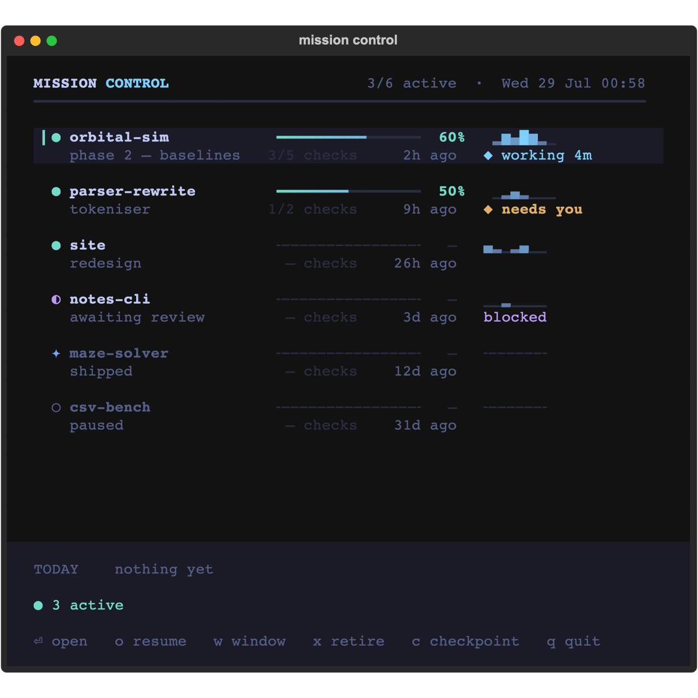

# mission control

A Textual TUI for keeping track of several Claude Code projects at once.

<p align="center">
  
</p>

**[Full guide →](GUIDE.md)**: commands, daily flow, and the gotchas.

---

## The problem

Four or five projects on the go, each with its own Claude sessions, and nowhere
that tracks where any of them stand. You open one, read the last commit, try to
remember what "done" was supposed to mean, and lose ten minutes before any work
starts. The ones you haven't touched in a fortnight quietly stop existing.

mission control is a single screen that answers four questions: what am I
working on, how far through is each one, what is the next thing, and is anything
running right now. The percentages are computed from predicates rather than
remembered, so they stay true whether or not you kept them updated.

---

## Install

```sh
uv tool install git+https://github.com/StanKarz/mission-control
mc init          # writes a starter config
mc doctor        # lists every directory on your machine with Claude sessions
```

Add the ones you care about to the config, then run `mc`.

Requires Python 3.12+. tmux is optional; only the launcher needs it.

---

## What it does

### One row per project

Status, percentage, a week of session activity, and when it was last touched.
The highlighted row expands in place to show its description, the **next unmet
check**, the last commit and the last session. Choosing what to pick up needs
the next action far more than it needs a percentage.

By default only live work is listed. Finished and parked projects are one `a`
away rather than cluttering the view.

### Progress you can't fake

A hand-ticked checklist rots. You tick three boxes in week one, never open it
again, and the percentage becomes a lie that's worse than no number. So every
item that *can* be a **predicate the app evaluates on open** is one:

```toml
[[projects."orbital-sim".checks]]
name  = "eval harness green"
type  = "cmd"                          # passes on exit 0
value = "pytest -q tests/test_eval.py"

[[projects."orbital-sim".checks]]
name  = "baseline run"
type  = "path"                         # file exists
value = "results/baseline.json"

[[projects."orbital-sim".checks]]
name  = "picked the reward shaping"    # nothing can measure this one
type  = "manual"
done  = false                          # toggled with `space`, or edited here
```

Five types: `path`, `git_tag`, `cmd`, `gh_pr`, and `manual` for the rest.

`manual` covers the real work no predicate can see: an outline reorganised, a
decision finally made. You tick those yourself with `space` on the detail
screen, and `space` refuses the other four types. An overridable predicate is a
checklist with extra steps.

`path`, `git_tag` and `manual` are cheap and evaluate on every open. `cmd` and
`gh_pr` shell out or hit the network, so they never run in a render path. Press
`c` (or run `mc check`) to evaluate them; the cached result counts towards the
percentage until you run them again.

Progress is `passing ÷ total`, recomputed every time, so it can't drift. A
project with no checks shows `—`, never `0%`.

The upstream benefit is the real one: it forces you to say what done *looks
like*. "Writeup" isn't a check. "`writeup.md` exists and is over 800 words" is.

### Launches work into the pane next door

`mc work` gets you the layout: your shell where you are, the roster beside it,
reusing an existing split rather than adding a third pane. From there, `o` on a
row sends `cd <path> && claude --resume <id>` to the tmux pane on your left. If that pane is busy (usually, since it's where Claude runs) the send is
**refused** rather than typed into the running program as a prompt, and `w`
opens a new window instead.

### Tells you when you're free

Any project with a running session shows `◆ working 4m` or `◆ needs you`,
refreshed every few seconds from the tail of the live transcript. Useful during
a long agent run, when the honest options are otherwise "stare at it" or "start
a second session and hold two mental stacks".

### Rolls up the week and the month

```sh
mc week          # what happened this week
mc week 1        # ...last week
mc month         # calendar month
```

Per project, each in its own colour: what was pushed, what was worked on (the
session titles Claude writes for itself), how many edits, and where the checks
stand. Plus which projects went quiet.

Nothing is summarised by a model, the commit message *is* the summary, written
by whoever made the change. The month view is also what the checkpoint screen
shows.

### Keeps sessions attached to their projects

Claude Code names each session directory after the absolute path you launched
from, and records that mapping nowhere else. Move or rename a project and the
link silently breaks: the history is still on disk but `claude --resume` can no
longer see it, and there's no built-in repair.

```sh
mc doctor                    # sort every slug: linked, nested, untracked, stranded, ignored
mc fix                       # relink the stranded ones (dry run)
mc fix --go                  # actually do it
mc mv blog ~/archived        # move a project, carrying its sessions
```

Everything that mutates is a **dry run unless you pass `--go`**, archives to
`~/.claude/archive/` first, and verifies transcript line counts after. Nothing
is ever deleted.

---

## Configuration

One TOML file, hand-editable, at `~/.config/mission-control/progress.toml`
(override with `MC_CONFIG`). Press `r` in the roster to pick up edits.

```toml
[meta]
project_roots = ["~/projects", "~/archived-projects"]
ignore        = ["~/Desktop"]           # has sessions, isn't a project
checkpoint_questions = ["What did I ship?", "What did I avoid?"]

[projects."orbital-sim"]
path   = "~/projects/orbital-sim"
status = "active"   # active | blocked | paused | done | archived | ignored
phase  = "phase 2 — baselines"
desc   = "what this is, in one line"    # optional, shown on the selected row
```

Activity is **never** recorded here. It's derived from the session store and
`git log`; the file holds intent only. The roster shows exactly what this file
lists, and nothing is auto-discovered.

### Optional: brief Claude on where the project stands

```json
{ "hooks": { "SessionStart": [ { "hooks": [ {
  "type": "command",
  "command": "mc brief --hook"
} ] } ] } }
```

Every session then opens knowing the current phase and next unmet check.
(`SessionStart` hooks need a specific JSON envelope; plain stdout is silently
dropped. `mc brief --hook` emits it correctly.)

---

## Keys

Vim keys throughout: `j`/`k` to move, `⏎` to open a project, `o` to resume it in
the left pane, `space` to tick a manual check, `a` to reveal finished work,
`q` to quit. [Full key map →](GUIDE.md#keys)

Run `mc --help` for the commands.

---

## Non-goals

No habit tracking, calendars, pomodoro timers, or sync. No database, just one
TOML file and the session store. **No writes to `~/.claude.json`**, which every
running session rewrites constantly. No LLM calls. No cost or token display: the
data is right there, which is exactly why it needs saying. Watching the meter
changes how you work, and not for the better.

## Development

```sh
uv run pytest        # 102 tests, ~8s
```

Tests are weighted towards where a bug is silent and expensive: slug encoding,
reconcile planning, the checks engine, period arithmetic, tmux target
resolution. Plus smoke tests that render every screen and exercise the key map,
added after a `NameError` in the detail view shipped, which pure-logic tests
structurally could not catch.

New behaviour worth trusting is verified by breaking it on purpose and
confirming a test fails. Mocking an assumption you have not tested just
enshrines it.

## Licence

MIT
